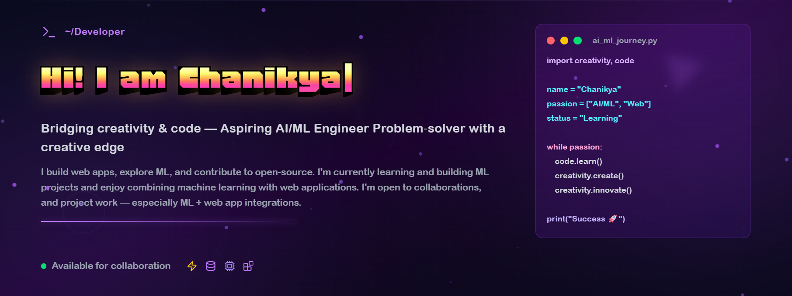

  

---

### 🔗 Connect

  
  
  

---

🤝 Let’s Build Something Together

I’m always excited to collaborate on projects that combine ML, AI, and web development. Whether you’re starting a new idea, need help prototyping, or want to integrate machine learning into your projects, I’m happy to help.

If you have a project in mind, let’s connect and make it happen!

📬 Reach out to me: karrichanikya@gmail.com

💻 Full-stack development and web app building

🤖 ML/AI project integration and prototyping

🌱 Open-source contributions and mentorship

---

### 🛠 Skills

<!-- Skill icons (from tandpfun/skill-icons) -->

---

### 📊 GitHub — stats & activity

<h3> 🔥 Streak Stats </h3>

  

<h3>💻 GitHub Profile Stats</h3>

<!-- GitHub Stats -->

  
  

 

---

#### Profile views

  

---

## 🏅 Holopin Badges

---

*Made with ❤️ — feel free to tell me any edits you want.*
